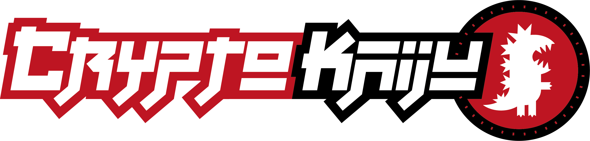

<h1 align="center">
  
</h1>

<h1 align="center">CryptoKaiju</h1>

  Collectable Vinyl Toys Powered By The Ethereum Blockchain.

 

  
  
  
  
  
  

# Authors

Dreamt up by [coinjournal](https://coinjournal.net) in partnership with [KnownOrigin](https://twitter.com/knownorigin_io) and [BlockRocket](http://blockrocket.tech)

# Features

* **Full ERC-721 Compatibility** - Smart Contract is fully ERC-721 compliant
* **Full ERC-721 Metadata Compatibility** - Each ERC-721 token uses latest standards for ERC-721 metadata
* **Full ERC-165 Compatibility** - Smart Contract is fully ERC-165 compliant
* **IPFS Support** - Internally IPFS is used for storing asset files and metadata

# License

[MIT](https://opensource.org/licenses/MIT)
